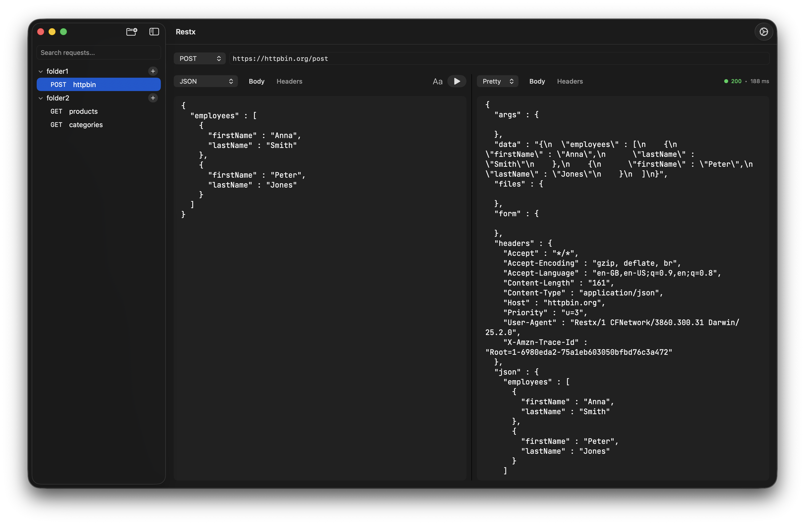

# Restx

A simple native macOS REST API client.

## Screenshots



## Installation

Build the project using Xcode:

```bash
make release
```

## Data Storage

### Request Collections
All your HTTP requests and folders are automatically saved to:
```
~/Documents/restx/collections.json
```

### Configuration
Application settings are saved to:
```
~/.config/restx/config.json
```
